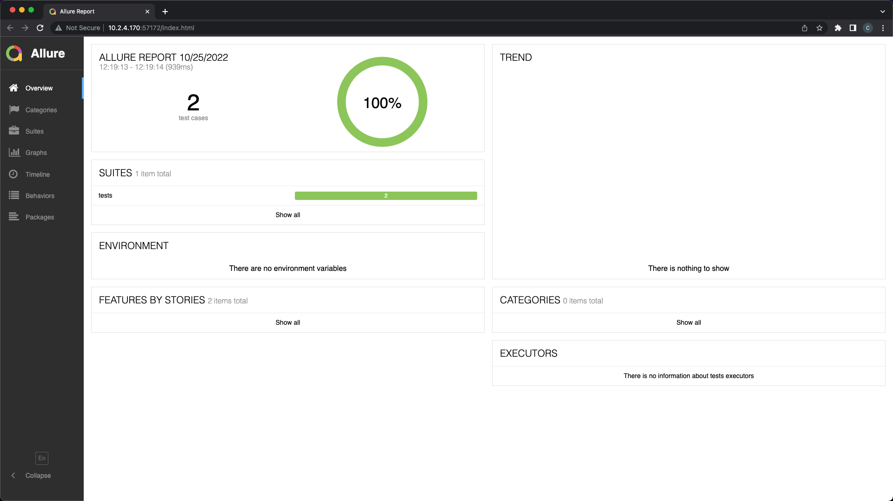

# 📊 Visualize Test Results with Allure


Pylenium uses <mark style="color:yellow;">**`pytest`**</mark> as the Test Framework and uses <mark style="color:yellow;">**`pytest-allure`**</mark> for reporting. However, you can use your preferred reporting strategy since it's easy to extend the framework :thumbsup:


Visit Allure's websites for more info and details:

* Official website: [https://qameta.io/allure-report/](https://qameta.io/allure-report/)
* Official docs: [https://docs.qameta.io/allure-report/](https://docs.qameta.io/allure-report/)

## Quickstart

Pylenium comes with Allure natively integrated, so all you have to do is add the **--alluredir** argument to the pytest command. Besides that, continue using Pylenium and pytest normally 😄

### 1. Install allure

Visit their [installation docs](https://docs.qameta.io/allure-report/#\_installing\_a\_commandline) and install allure using the appropriate method. For example, on Macs, you can use homebrew:


```bash
brew install allure
```


Pylenium also includes a [CLI command](../cli/allure-cli.md) to try and do the installation for you:


```bash
pylenium allure install
```



It's recommended to visit Allure's docs and install it from there. For example, the Linux instructions require the use of **`sudo`** and you want to make sure you trust it first before executing 👍🏽


### 2. Run Tests


```bash
pytest --alluredir=allure-report
```


⬆️ That creates a folder called **`./allure-report`** and stores the test results there

### 3. Serve Test Results

Then you generate the results into an Allure Report and "serve" it:


```bash
allure serve allure-report
```



It's recommended to use the <mark style="color:yellow;">**`allure`**</mark> command directly instead of through Pylenium:



```bash
pylenium allure serve
```


### 4. View the Report

By default, allure will open a new window or browser tab in your default browser and show you something like this:

<figure><figcaption><p>Local example</p></figcaption></figure>

Take some time to review all of the data that you get from this report, but some notable mentions:

* pass/fail percentages
* trends in historical test results


Yes, the more you run tests and save them to the same folder, you'll get more data in the report!


* detailed steps on setup and teardown of each test
* logs automatically included for each test
* on test failure, a screenshot is automatically taken and attached to the test
* test case durations and test run durations
* other visuals in the Graphs tab
* and more!

## Advanced Usage

If you haven't checked out their [official docs](https://docs.qameta.io/allure-report/#\_pytest) yet, you should because they go over what you can send, how you send it, and how to use the Allure Report once it's served!

_This guide will cover more common scenarios_

### Attaching screenshots

By default, Pylenium already takes a screenshot and attaches it to allure on any test failure so you can see the last "view" of the page before the test failed. However, you can add more screenshots.

For example, if you want to take a screenshot after every page transition, this is what the scripted version of the test would look like:


```python
import allure
from pylenium.driver import Pylenium


def test_attach_screenshots(py: Pylenium):
    # Go to QAP Home page
    py.visit("https://qap.dev")
    allure.attach(py.webdriver.get_screenshot_as_png(), "home.png", allure.attachment_type.PNG)
    
    # Navigate to Leadership page
    py.get("[href='/about']").hover()
    py.get("[href='/leadership']").click()
    allure.attach(py.webdriver.get_screenshot_as_png(), "leadership.png", allure.attachment_type.PNG)
    
    # Screenshot taken and attached automatically if any part of the test fails
    assert py.contains("@CarlosKidman")
```


Run the test


```bash
pytest -k test_attach_screenshots --alluredir=allure-report
```


Serve the report


```bash
allure serve allure-report
```


And observe that we have both screenshots in the Test Body section of our test report:

<figure><figcaption><p>Both screenshots are attached to the test</p></figcaption></figure>

<mark style="color:yellow;">**allure.attach()**</mark> is all you need, meaning that you can add it to your Page Objects, flow functions, or even as a reusable decorator!


allure knows the current test that is running and attaches the screenshot appropriately. You don't have to worry about "assigning" it to the right test.


### Tagging Tests

pytest tags (aka _marks_) tests using its <mark style="color:yellow;">**`mark`**</mark> feature and allure simply leverages it. Take the following example:


```python
import pytest
from pylenium.driver import Pylenium


@pytest.fixture(scope="session")
def sauce(pys: Pylenium) -> Pylenium:
    """Login to saucedemo.com as standard user."""
    pys.visit("https://www.saucedemo.com/")
    pys.get("#user-name").type("standard_user")
    pys.get("#password").type("secret_sauce")
    pys.get("#login-button").click()
    yield pys
    pys.get("#react-burger-menu-btn").click()
    pys.get("#logout_sidebar_link").should().be_visible().click()


class TestSauceDemo:
    @pytest.mark.single_item
    def test_add_to_cart_css(self, sauce: Pylenium):
        """Add an item to the cart. The number badge on the cart icon should increment as expected."""
        sauce.get("[id*='add-to-cart']").click()
        assert sauce.get("a.shopping_cart_link").should().have_text("1")

    @pytest.mark.many_items
    def test_add_to_cart_xpath(self, sauce: Pylenium):
        """Add 6 different items to the cart. There should be 6 items in the cart."""
        for button in sauce.findx("//*[contains(@id, 'add-to-cart')]"):
            button.click()
        sauce.getx("//a[@class='shopping_cart_link']").click()
        assert sauce.findx("//*[@class='cart_item']").should().have_length(6)

```


We can run all tests in the file


```bash
pytest tests/test_sauce_demo.py --alluredir=allure-report
```


Or we can run a subset of tests given their tag or mark using the <mark style="color:yellow;">**`-m`**</mark> flag

```
pytest -m single_item --alluredir=allure-report
```

Either way, we now see the tag(s) on the test in our report

<figure><figcaption><p>You can have as many tags on a test as you'd like</p></figcaption></figure>


Also notice how the docstring in the test function has been converted to a Description in our report! 👀


### Categorize Tests

In pytest, you can use the [mark feature to tag tests](visualize-test-results-with-allure.md#tagging-tests). However, in Allure, they have a unique way to categorize tests based on each test's results.


⬆️ Visit this section of their docs to see how ⬆️


### Link Results to a Bug Reporter

To integrate the Allure Report with a bug tracker or test management system, Allure has **`@allure.link`**, **`@allure.issue`** and **`@allure.testcase`** descriptors.


⬆️ Visit this section of their docs to see how ⬆️


### Mark Tests with Severity

The **severity mark** is part of Allure, not pytest. For example:

```python
import allure

@allure.severity(allure.severity_level.CRITICAL)
def test_with_critical_severity():
    pass
```


This is another way to mark and filter tests!



⬆️ Visit this section of their docs to see how ⬆️



